# Digital Banking - Présentation du Projet

## Introduction

Ce projet démontre la conception et l'implémentation d'une application bancaire digitale complète utilisant les technologies Java, Spring Boot et Angular. L'application permet la gestion des comptes bancaires, des clients, et des opérations financières, le tout dans une architecture sécurisée et moderne.

### Objectifs du Projet

1. **Mettre en œuvre une architecture microservices** avec Spring Boot et Angular
2. **Implémenter un système d'authentification robuste** basé sur JWT (JSON Web Tokens)
3. **Appliquer les principes de conception** comme l'architecture en couches, l'injection de dépendances, et les patterns DTO
4. **Développer une interface utilisateur responsive et intuitive** avec Angular et Bootstrap
5. **Sécuriser l'accès aux ressources** avec Spring Security et la gestion des rôles (RBAC)

### Fonctionnalités Principales

- **Gestion des Clients**: Ajout, modification, suppression et recherche de clients
- **Gestion des Comptes**: Support pour différents types de comptes (courant, épargne)
- **Opérations Bancaires**: Débit, crédit et transfert entre comptes
- **Gestion des Utilisateurs**: Authentification, gestion des rôles, et profils utilisateurs
- **Tableau de Bord**: Visualisation des statistiques et informations de synthèse
- **Interface Responsive**: Adaptée à tous les appareils (desktop, tablette, mobile)

### Technologies Utilisées

#### Backend:
- Java 17
- Spring Boot 3.x (Web, Data JPA, Security)
- Spring Security avec JWT
- Base de données H2 (développement) / MySQL (production)
- Maven pour la gestion des dépendances
- JUnit et Mockito pour les tests

#### Frontend:
- Angular 17+ avec composants standalone
- TypeScript
- Bootstrap 5 pour le design responsive
- RxJS pour la programmation réactive
- JWT pour la gestion de l'authentification côté client
- Chart.js pour les visualisations de données

## Structure Générale

L'application suit une architecture en couches classique:
- **Entités**: Classes JPA représentant la structure des données
- **DTOs**: Objets de transfert de données
- **Repositories**: Interfaces d'accès aux données
- **Services**: Logique métier
- **Controllers**: Points d'entrée API REST
- **Sécurité**: Gestion de l'authentification et des autorisations

## Diagramme de Classes en PlantUML

```plantuml
@startuml Digital Banking Backend - Class Diagram

' Style settings
skinparam classAttributeIconSize 0
skinparam monochrome true
skinparam shadowing false
skinparam linetype ortho

' Package Entities
package "Entities" {
  abstract class BankAccount {
    -id: String
    -balance: double
    -createdAt: Date
    -currency: String
    -status: AccountStatus
    -createdBy: String
    -lastModifiedBy: String
  }
  
  class SavingAccount {
    -interestRate: double
  }
  
  class CurrentAccount {
    -overDraft: double
  }
  
  class Customer {
    -id: Long
    -name: String
    -email: String
    -phone: String
    -createdBy: String
    -lastModifiedBy: String
  }
  
  class AccountOperation {
    -id: Long
    -operationDate: Date
    -amount: double
    -description: String
    -type: OperationType
    -createdBy: String
  }
}

' Package Security Entities
package "Security Entities" {
  class AppUser {
    -id: Long
    -username: String
    -password: String
    -active: boolean
  }
  
  class AppRole {
    -id: Long
    -roleName: String
  }
}

' Package Services
package "Services" {
  interface BankAccountService {
    +saveCustomer(customerDTO: CustomerDTO): CustomerDTO
    +updateCustomer(customerDTO: CustomerDTO): CustomerDTO
    +deleteCustomer(customerId: Long): void
    +listCustomers(): List<CustomerDTO>
    +searchCustomers(keyword: String): List<CustomerDTO>
    +getCustomer(customerId: Long): CustomerDTO
    +saveCurrentBankAccount(initialBalance: double, overDraft: double, customerId: Long): CurrentAccountDTO
    +saveSavingBankAccount(initialBalance: double, interestRate: double, customerId: Long): SavingAccountDTO
    +listBankAccounts(): List<BankAccountDTO>
    +getCustomerAccounts(customerId: Long): List<BankAccountDTO>
    +getBankAccount(accountId: String): BankAccountDTO
    +debit(accountId: String, amount: double, description: String): void
    +credit(accountId: String, amount: double, description: String): void
    +transfer(accountIdSource: String, accountIdDestination: String, amount: double): void
    +accountOperationHistory(accountId: String): List<AccountOperationDTO>
    +accountHistory(accountId: String, page: int, size: int): AccountHistoryDTO
  }
  
  class BankAccountServiceImpl {
    -customerRepository: CustomerRepository
    -bankAccountRepository: BankAccountRepository
    -accountOperationRepository: AccountOperationRepository
    -dtoMapper: BankAccountMapperImpl
  }
  
  interface SecurityService {
    +saveNewUser(username: String, password: String, confirmedPassword: String): AppUser
    +saveNewRole(roleName: String): AppRole
    +addRoleToUser(username: String, roleName: String): void
    +removeRoleFromUser(username: String, roleName: String): void
    +loadUserByUsername(username: String): AppUser
    +listUsers(): List<AppUser>
    +changePassword(username: String, oldPassword: String, newPassword: String): boolean
  }
  
  class SecurityServiceImpl {
    -appUserRepository: AppUserRepository
    -appRoleRepository: AppRoleRepository
    -passwordEncoder: PasswordEncoder
  }
  
  class JWTService {
    -secretKey: String
    -jwtExpiration: long
    -refreshExpiration: long
    +extractUsername(token: String): String
    +generateToken(userDetails: UserDetails): String
    +isTokenValid(token: String, userDetails: UserDetails): boolean
  }
}

' Package Controllers
package "Controllers" {
  class CustomerRestController {
    -bankAccountService: BankAccountService
  }
  
  class BankAccountRestController {
    -bankAccountService: BankAccountService
  }
  
  class AuthController {
    -authenticationManager: AuthenticationManager
    -jwtUtils: JwtUtils
    -securityService: SecurityService
  }
  
  class UserManagementController {
    -securityService: SecurityService
  }
}

' Package Repositories
package "Repositories" {
  interface CustomerRepository {
    +findByNameContainsIgnoreCase(keyword: String): List<Customer>
    +findByEmail(email: String): Customer
  }
  
  interface BankAccountRepository {
    +findByCustomerId(customerId: Long): List<BankAccount>
  }
  
  interface AccountOperationRepository {
    +findByBankAccountId(accountId: String): List<AccountOperation>
    +findByBankAccountId(accountId: String, pageable: Pageable): Page<AccountOperation>
    +findByBankAccountIdOrderByOperationDateDesc(accountId: String, pageable: Pageable): Page<AccountOperation>
  }
  
  interface AppUserRepository {
    +findByUsername(username: String): AppUser
  }
  
  interface AppRoleRepository {
    +findByRoleName(roleName: String): AppRole
  }
}

' Package DTOs
package "DTOs" {
  class CustomerDTO {
    -id: Long
    -name: String
    -email: String
    -phone: String
  }
  
  abstract class BankAccountDTO {
    -id: String
    -balance: double
    -createdAt: Date
    -status: AccountStatus
    -customerDTO: CustomerDTO
    -type: String
  }
  
  class CurrentAccountDTO {
    -overDraft: double
    -currency: String
  }
  
  class SavingAccountDTO {
    -interestRate: double
    -status: AccountStatus
    -type: String
    -currency: String
  }
  
  class AccountOperationDTO {
    -id: Long
    -operationDate: Date
    -amount: double
    -description: String
    -type: OperationType
    -bankAccountId: String
  }
  
  class AccountHistoryDTO {
    -accountId: String
    -balance: double
    -currentPage: int
    -totalPages: int
    -pageSize: int
    -accountOperationDTOS: List<AccountOperationDTO>
  }
}

' Package Enums
package "Enums" {
  enum AccountStatus {
    CREATED
    ACTIVATED
    SUSPENDED
    BLOCKED
  }
  
  enum OperationType {
    DEBIT
    CREDIT
  }
}

' Package Mappers
package "Mappers" {
  class BankAccountMapperImpl {
    +fromCustomer(customer: Customer): CustomerDTO
    +fromCustomerDTO(customerDTO: CustomerDTO): Customer
    +fromSavingAccount(savingAccount: SavingAccount): SavingAccountDTO
    +fromSavingAccountDTO(savingAccountDTO: SavingAccountDTO): SavingAccount
    +fromCurrentAccount(currentAccount: CurrentAccount): CurrentAccountDTO
    +fromCurrentAccountDTO(currentAccountDTO: CurrentAccountDTO): CurrentAccount
    +fromAccountOperation(accountOperation: AccountOperation): AccountOperationDTO
  }
}

' Package Exceptions
package "Exceptions" {
  class CustomerNotFoundException {
    +CustomerNotFoundException(message: String)
  }
  
  class BankAccountNotFoundException {
    +BankAccountNotFoundException(message: String)
  }
  
  class BalanceNotSufficientException {
    +BalanceNotSufficientException(message: String)
  }
}

' Package JWT
package "JWT" {
  class JwtUtils {
    -jwtSecret: String
    -jwtExpirationMs: long
    +generateJwtToken(authentication: Authentication): String
    +getUsernameFromJwtToken(token: String): String
    +validateJwtToken(authToken: String): boolean
  }
}

' Relations
BankAccount <|-- SavingAccount
BankAccount <|-- CurrentAccount
Customer "1" --* "many" BankAccount
BankAccount "1" --* "many" AccountOperation
AppUser "many" -- "many" AppRole

BankAccountService <|.. BankAccountServiceImpl
SecurityService <|.. SecurityServiceImpl

CustomerRestController --> BankAccountService
BankAccountRestController --> BankAccountService
AuthController --> SecurityService
AuthController --> JwtUtils
UserManagementController --> SecurityService

BankAccountServiceImpl --> CustomerRepository
BankAccountServiceImpl --> BankAccountRepository
BankAccountServiceImpl --> AccountOperationRepository
BankAccountServiceImpl --> BankAccountMapperImpl

SecurityServiceImpl --> AppUserRepository
SecurityServiceImpl --> AppRoleRepository

BankAccountDTO <|-- CurrentAccountDTO
BankAccountDTO <|-- SavingAccountDTO

@enduml
```

## Description des Principales Classes

### Couche Entités

1. **BankAccount**
   - Classe abstraite de base pour tous les comptes bancaires
   - Deux sous-types: `CurrentAccount` (compte courant) et `SavingAccount` (compte épargne)
   - Utilise l'héritage avec une stratégie de table unique (single-table inheritance)

2. **Customer**
   - Représente un client du système bancaire
   - Possède une relation one-to-many avec les comptes bancaires

3. **AccountOperation**
   - Représente une opération bancaire (débit ou crédit)
   - Associée à un compte bancaire spécifique

4. **AppUser & AppRole**
   - Entités de sécurité pour la gestion des utilisateurs et rôles
   - Relation many-to-many entre utilisateurs et rôles

### Couche Services

1. **BankAccountService**
   - Interface définissant les opérations du service bancaire
   - Opérations CRUD sur les clients et les comptes
   - Opérations bancaires: débit, crédit, transfert

2. **SecurityService**
   - Interface pour la gestion des utilisateurs, rôles et authentification
   - Création et gestion des utilisateurs et leurs rôles

3. **JWTService**
   - Gestion des JSON Web Tokens pour l'authentification
   - Génération et validation des tokens

### Couche Repositories

Interfaces Spring Data JPA pour l'accès aux données:
- CustomerRepository
- BankAccountRepository
- AccountOperationRepository
- AppUserRepository
- AppRoleRepository

### DTOs (Data Transfer Objects)

Objets utilisés pour transférer des données entre les couches:
- CustomerDTO
- BankAccountDTO (avec ses sous-types)
- AccountOperationDTO
- AccountHistoryDTO

### Enums

- **AccountStatus**: États possibles d'un compte (CREATED, ACTIVATED, SUSPENDED, BLOCKED)
- **OperationType**: Types d'opérations bancaires (DEBIT, CREDIT)